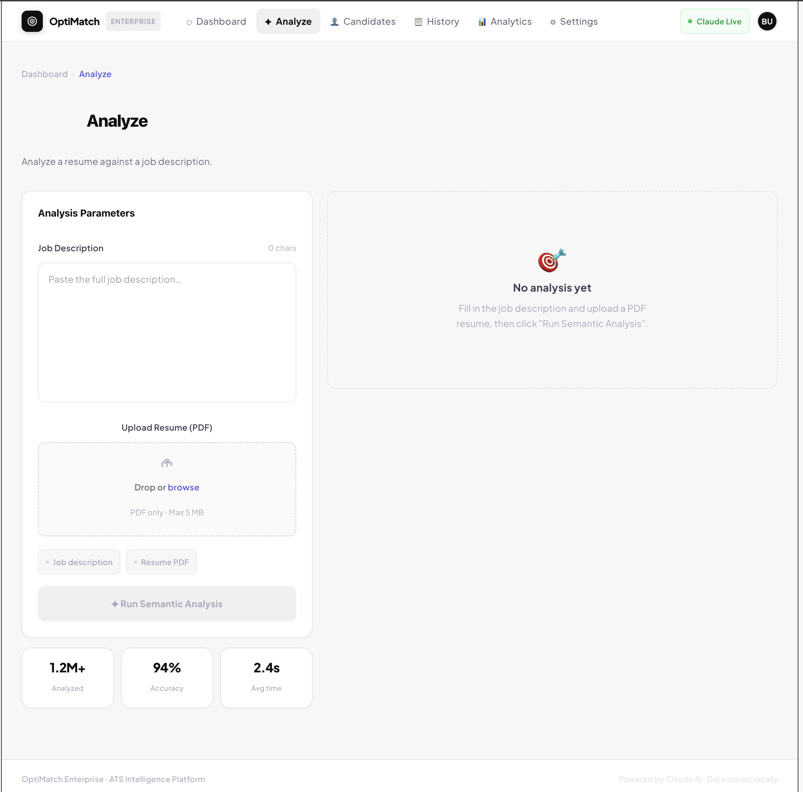
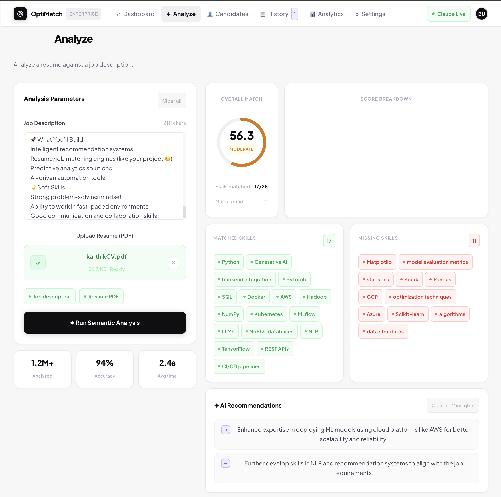
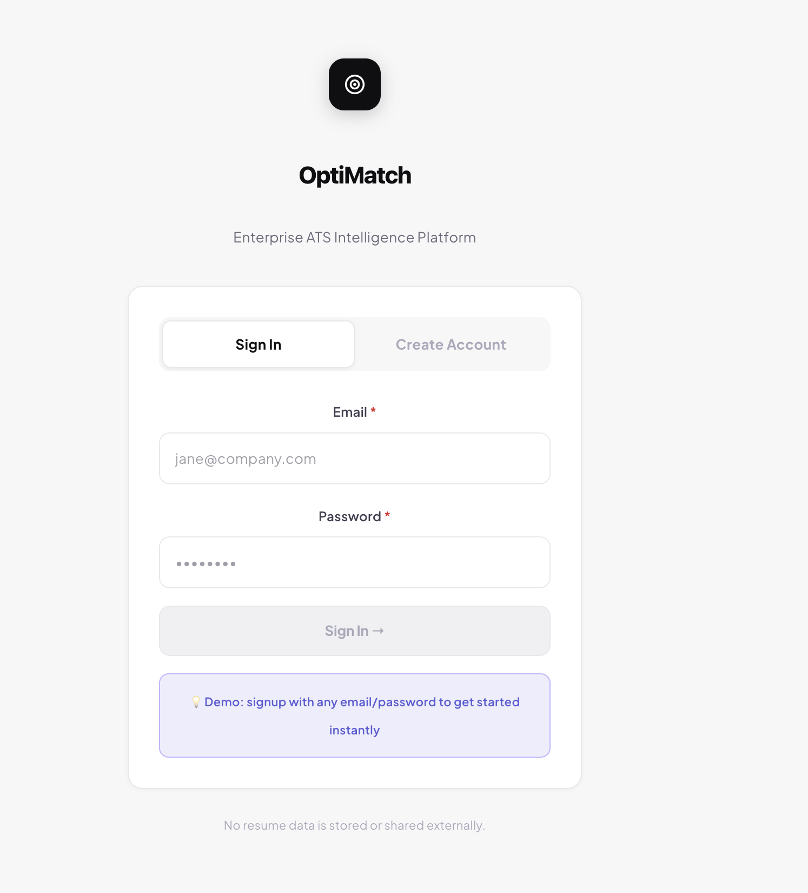

<div align="center">

# ⚡ OptiMatch

### AI-Powered Resume Analyzer & ATS Scoring System

[](https://python.org)
[](https://fastapi.tiangolo.com)
[](https://react.dev)
[](LICENSE)

**Upload your resume. Paste a job description. Get hired faster.**

[Features](#-features) · [Demo](#-demo) · [Getting Started](#-getting-started) · [Tech Stack](#-tech-stack) · [Contributing](#-contributing)

</div>

---

## 📌 What is OptiMatch?

OptiMatch is an AI-powered ATS (Applicant Tracking System) that evaluates your resume against any job description using semantic analysis, NLP, and intelligent scoring — giving you actionable feedback before a real recruiter ever sees your application.

---

## ✨ Features

| Feature | Description |
|---|---|
| 🎯 **ATS Match Score** | Get a 0–100 compatibility score against any job description |
| 🔍 **Skill Gap Analysis** | Instantly see matched skills, missing skills, and areas to improve |
| 🧠 **AI Insights** | LLM-powered, context-aware feedback — not just keyword matching |
| 📄 **PDF Resume Parsing** | Upload any real-world resume PDF; we handle the messy formatting |
| 📊 **Smart Dashboard** | Visual score breakdown with prioritized recommendations |
| ⚡ **Real-Time Results** | Optimized backend pipeline with fast response times |

---

## 🖼️ Demo







---

## ⚙️ How It Works

```
Upload Resume (PDF)
       ↓
  Text Extraction
       ↓
  NLP Processing
       ↓
 Semantic Matching  ←──  Job Description
       ↓
ATS Score + Insights
       ↓
Frontend Visualization
```

---

## 🏗️ Tech Stack

**Frontend**
- React.js + Vite
- Tailwind CSS

**Backend**
- FastAPI (Python)

**AI / ML**
- NLP & Semantic Similarity Models
- LLM-based suggestions (OpenAI)

**Database**
- SQLite (dev) / PostgreSQL (prod)

**DevOps**
- Docker
- CI/CD Pipeline

---

## 🚀 Getting Started

### Prerequisites

- Python 3.10+
- Node.js 18+
- An [OpenAI API key](https://platform.openai.com/api-keys)

---

### 1. Clone the Repository

```bash
git clone https://github.com/bunny182005/AI-Powered-Resume-Analyzer-ATS-Scoring-Job-Fit-Matching-System
cd AI-Powered-Resume-Analyzer-ATS-Scoring-Job-Fit-Matching-System
```

---

### 2. Backend Setup

```bash
cd backend

# Create and activate virtual environment
python -m venv .venv
source .venv/bin/activate        # macOS / Linux
.venv\Scripts\activate           # Windows

# Install dependencies
pip install -r requirements.txt

# Start the development server
PYTHONPATH=. uvicorn src.main:app --reload
```

The API will be available at `http://localhost:8000`.

---

### 3. Environment Variables

Create a `.env` file inside the `backend/` directory:

```env
OPENAI_API_KEY=your_openai_api_key_here
```

---

### 4. Frontend Setup

```bash
cd frontend

npm install
npm run dev
```

The app will be available at `http://localhost:5173`.

---

## 📁 Project Structure

```
.
├── backend/
│   ├── src/
│   │   └── main.py
│   ├── requirements.txt
│   └── .env
├── frontend/
│   ├── src/
│   ├── package.json
│   └── vite.config.js
└── README.md
```

---

## 🎯 Use Cases

- 🎓 **Students** — Tailor resumes for internships and entry-level roles
- 💼 **Job Seekers** — Maximize ATS pass rates before applying
- 🧑‍💻 **Developers** — Reference implementation for AI-powered document analysis
- 🏢 **Recruiters** — Quickly screen and score incoming applications

---

## 🔮 Roadmap

- [ ] AI-powered resume auto-rewrite
- [ ] Interview question generation based on skill gaps
- [ ] Multi-job comparison mode
- [ ] Advanced analytics dashboard
- [ ] Support for DOCX resumes

---

## 🤝 Contributing

Contributions are welcome! Here's how to get started:

1. Fork the repository
2. Create a feature branch — `git checkout -b feature/your-feature`
3. Commit your changes — `git commit -m 'Add your feature'`
4. Push to your branch — `git push origin feature/your-feature`
5. Open a Pull Request

Please open an issue first for major changes so we can discuss the approach.

---

## 📜 License

This project is licensed under the [MIT License](LICENSE).

---

<div align="center">

If OptiMatch helped you land an interview, give it a ⭐ — it means a lot!

</div>
